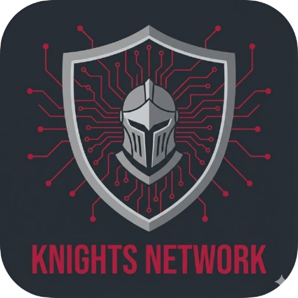

<p align="center">
  
</p>

<h1 align="center">Knights Network</h1>

<p align="center">
  Client IRC moderne et sécurisé pour le réseau des Knights of Eternity
</p>

<p align="center">
  <a href="https://github.com/ronalove/conduit/releases/latest">
    
  </a>
  <a href="https://github.com/ronalove/conduit/actions/workflows/release.yml">
    
  </a>
  <a href="https://github.com/ronalove/conduit/blob/main/LICENSE">
    
  </a>
  <a href="https://github.com/ronalove/conduit/releases">
    
  </a>
</p>

<p align="center">
  <a href="#installation">Installation</a> •
  <a href="#fonctionnalités">Fonctionnalités</a> •
  <a href="#développement">Développement</a> •
  <a href="docs/USER_MANUAL.md">Documentation</a>
</p>

&nbsp;

<p align="center">
  
</p>

&nbsp;

## À propos

Knights Network est un client IRC multi-plateforme. Il est conçu spécifiquement pour la communauté des Chevaliers de l'Éternité et offre une expérience de chat moderne avec support complet des spécifications IRCv3.

**Caractéristiques principales :**

- Interface moderne Desktop/Mobile
- Authentification sécurisée via SASL
- Prise en charge des dernières spécifications IRC :
  - Notifications AFK
  - Bouncer intégré
  - Mention "... rédige un message"
  - Message tags
  - Messages multi-lignes
  - Réponses à message
  - Réactions

Certaines fonctionnalités, plus d'autres seront implémentées dans le futur.

&nbsp;

## Installation

Téléchargez la dernière version pour votre plateforme :

| Plateforme | Téléchargement | Instructions |
|------------|----------------|--------------|
| **Android** | [APK](https://github.com/ronalove/conduit/releases/latest) | Activer "Sources inconnues" dans les paramètres |
| **macOS** | [DMG](https://github.com/ronalove/conduit/releases/latest) | Clic-droit > Ouvrir (application non signée) |
| **Windows** | [ZIP](https://github.com/ronalove/conduit/releases/latest) | Extraire et lancer l'exécutable |
| **Linux** | [AppImage](https://github.com/ronalove/conduit/releases/latest) | `chmod +x` puis exécuter |

> **iOS** : Disponible prochainement via TestFlight

&nbsp;

## Fonctionnalités

### Spécifications IRCv3 supportées

<details>
<summary><strong>Core</strong></summary>

- CAP 302 - Négociation de capacités améliorée
- cap-notify - Notification de changement de capacités
- SASL v3.2 - Authentification PLAIN
- message-tags - Support complet des tags
- msgid - Identifiant de message
- server-time - Horodatage serveur
- echo-message - Écho des messages
- labeled-response - Corrélation requête/réponse
- standard-replies - Format de réponse standard
- multi-prefix - Modes utilisateur multiples
- UTF8ONLY - Encodage UTF-8

</details>

<details>
<summary><strong>Présence et utilisateurs</strong></summary>

- away-notify - Notification de statut absent
- account-notify - Notification de changement de compte
- account-tag - Tag de compte sur les messages
- chghost - Notification de changement d'hôte
- setname - Changement de nom réel
- extended-join - Informations JOIN étendues
- invite-notify - Notification d'invitation
- Monitor - Surveillance de présence
- WHOX - Requête WHO étendue

</details>

<details>
<summary><strong>Batch et historique</strong></summary>

- batch - Groupement de messages
- multiline - Messages multi-lignes
- chathistory - Récupération d'historique
- read-marker - Suivi de position de lecture

</details>

<details>
<summary><strong>Interactif</strong></summary>

- +typing - Indicateur de frappe
- reply - Référence de réponse
- channel-context - Contexte de canal pour DMs

</details>

<details>
<summary><strong>Sécurité</strong></summary>

- sts - Strict Transport Security
- Connexion TLS obligatoire
- SASL over TLS

</details>

&nbsp;

## Développement

### Prérequis

- Flutter 3.38+
- Dart 3.10+

### Démarrage rapide

```bash
# Cloner le repository
git clone https://github.com/ronalove/conduit.git
cd conduit

# Installer les dépendances
flutter pub get

# Générer le code (modèles, providers)
flutter pub run build_runner build

# Lancer l'application
flutter run -d macos  # ou windows, linux, ios, android
```

### Commandes utiles

```bash
# Mode watch pour la génération de code
flutter pub run build_runner watch

# Tests unitaires
flutter test

# Analyse statique
flutter analyze
```

&nbsp;

## Contribuer

Les contributions sont les bienvenues ! Consultez les [issues ouvertes](https://github.com/ronalove/conduit/issues) pour voir les tâches en cours.

&nbsp;

## Documentation

- [Manuel utilisateur](docs/USER_MANUAL.md)
- [Code Review / Audit technique](docs/CODE_REVIEW.md)
- [Roadmap](https://github.com/ronalove/conduit/milestones)

### Références IRCv3

- [IRCv3 Specifications](https://ircv3.net/irc/)
- [Modern IRC Documentation](https://modern.ircdocs.horse)

&nbsp;

## Licence

MIT - Voir le fichier [LICENSE](LICENSE) pour plus de détails.
